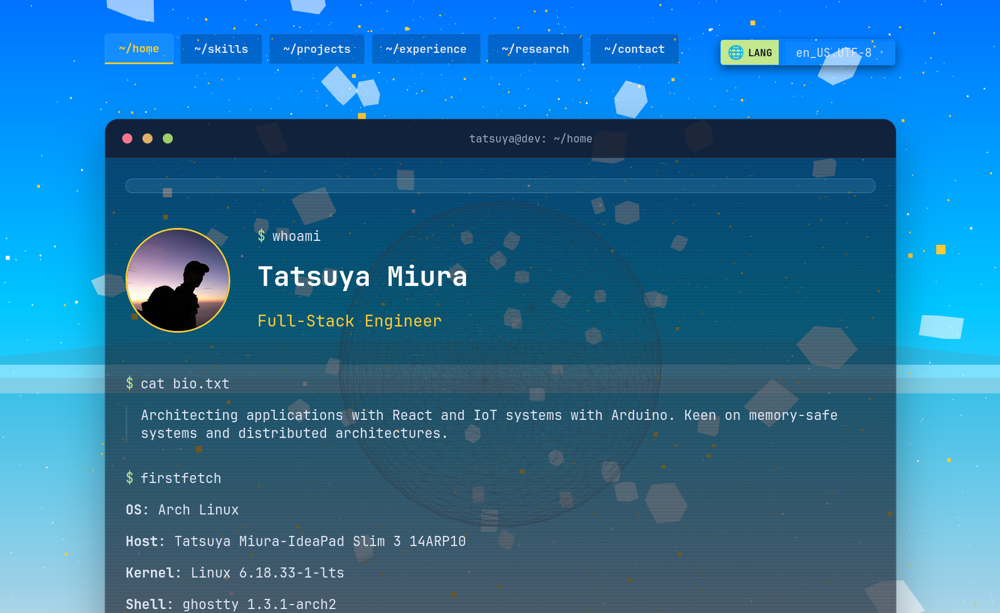

# TatsuyaM Portfolio (Hono && Bun edition)



A modern, interactive portfolio website built with **React 19**, **TypeScript**, and **Three.js**, featuring stunning 3D animations and multi-language support.

## ✨ Features

- **🎨 Modern Design**: Clean and professional portfolio interface with responsive layout
- **🌐 Multi-language Support**: English and Japanese with automatic language detection
- **🎭 3D Graphics**: Interactive 3D elements powered by Three.js
- **✨ Smooth Animations**: Beautiful transitions using Anime.js
- **📱 Responsive Design**: Optimized for desktop, tablet, and mobile devices
- **⚡ React 19 Compiler**: Built with latest React features for optimized performance
- **🚀 Vite**: Lightning-fast development and production builds
- **🔍 Type-Safe**: Full TypeScript support for robust code

## 🛠️ Tech Stack

- **Frontend**: React 19 with TypeScript (86.8%)
- **Styling**: CSS (11.9%)
- **Build Tool**: Bun
- **Backend Framework**: Hono
- **3D Graphics**: Three.js
- **Animations**: Anime.js
- **Internationalization**: i18next + react-i18next
- **Linting**: ESLint

## 📦 Dependencies

### Core Dependencies
```json
{
  "react": "^19.2.6",
  "react-dom": "^19.2.6",
  "hono": "^4.12.27",
  "three": "^0.184.0",
  "animejs": "^4.4.1",
  "i18next": "^26.3.1",
  "react-i18next": "^17.0.8"
}
```

### Dev Tools
```json
{
  "bun": "^1.3.14",
  "typescript": "~6.0.2",
  "eslint": "^10.3.0"
}
```

## 🚀 Quick Start

### Prerequisites
- Bun (v1.3.14-canary.1 or higher)

### Installation

```bash
# Clone the repository
git clone https://github.com/TatsuyaM2667/TatsuyaM-portfolio.git
cd TatsuyaM-portfolio

# Install dependencies
bun install
```

### Development

```bash
# Start dev server 
bun run dev
```

### Production

```bash
# Build for production
bun run build

```

## 📊 Project Overview

| Metric | Value |
|--------|-------|
| **Language** | TypeScript (86.8%) |
| **Styling** | CSS (11.9%) |
| **Other** | 1.3% |
| **Build Tool** | bun |
| **React Version** | 19.2.6 |
| **Hono** | 4.12.27 |

## 📁 Project Structure

```
TatsuyaM-portfolio/
├── src/
│   ├── components/      # Reusable React components
│   ├── pages/          # Page-level components
│   ├── hooks/          # Custom React hooks
│   ├── utils/          # Utility functions
│   ├── styles/         # Global & component styles
│   ├── assets/         # Images & media files
│   ├── locales/        # i18n translation files
│   └── App.tsx         # Main application
├── public/             # Static assets
│   └── ScreenShot.png  # Portfolio screenshot
├── package.json        # Dependencies & scripts
├── tsconfig.json       # TypeScript config
├── vite.config.ts      # Vite configuration
├── eslint.config.js    # ESLint rules
└── README.md          # This file
```

## 🌍 Language Support

The portfolio automatically detects your browser language:
- 🇬🇧 **English** - Default fallback language
- 🇯🇵 **日本語** - Japanese support
- 🇫🇷 **Français** - French support
- 🇩🇪 **Deutsch** - Germany support
- 🇨🇳 **简体中文** - Chinese support
- 🇰🇷 **한국어** - Korian support
- 🇮🇹 **Italiano** - Itarian support

Language detection powered by `i18next-browser-languagedetector`.

## 🎯 Key Features Explained

### React 19 Compiler
Leverages React 19's new compiler features for:
- Automatic component optimization
- Reduced re-renders
- Better performance

### 3D Visualizations
Three.js integration provides:
- Interactive 3D elements
- Smooth camera animations
- Custom shaders

### Anime.js Animations
Creates fluid, professional animations for:
- Page transitions
- Element reveals
- Interactive feedback

## 📝 Available Commands

```bash
bun run dev      # Start development server
bun run build    # Build for production
bun run preview  # Preview production build locally
bun run lint     # Check code quality with ESLint
```

## 🎨 Customization Guide

### Update Portfolio Content
Edit content files in `src/locales/` for multi-language updates.

### Styling
Modify CSS files in `src/styles/` to customize colors, fonts, and layout.

### Add Projects
Add portfolio projects in the projects component located in `src/components/`.

### Adjust Animations
Fine-tune Anime.js animations in animation configuration files.

### Modify 3D Elements
Update Three.js scene setup in the appropriate component files.

## 🔗 Links

- **GitHub Repository**: [TatsuyaM-portfolio](https://github.com/TatsuyaM2667/TatsuyaM-portfolio)
- **Author**: [@TatsuyaM2667](https://github.com/TatsuyaM2667)

## 📄 License

This project is open source. See the LICENSE file for details.

## 🤝 Contributing

We welcome contributions! To contribute:

1. **Fork** the repository
2. **Create** a feature branch (`git checkout -b feature/YourFeature`)
3. **Commit** changes (`git commit -m 'Add YourFeature'`)
4. **Push** to the branch (`git push origin feature/YourFeature`)
5. **Open** a Pull Request


## 📈 Performance

This portfolio is optimized for:
- Fast load times with Vite
- Smooth 60fps animations
- Efficient 3D rendering with Three.js
- Small bundle size through tree-shaking

---

## 🟢 Spotify "Now Playing" (optional)

This project includes an optional small helper server to show your current Spotify playback (similar to Discord's Spotify presence).

How it works (overview):

- A tiny Express server handles Spotify OAuth (Authorization Code flow) and stores a refresh token locally.
- The frontend polls `/api/now-playing` to fetch the current track and shows it in the Home page.

Setup (local development)

1. Create a Spotify Developer App at https://developer.spotify.com/dashboard and add a Redirect URI, e.g. `http://localhost:8888/auth/callback`.
2. Copy `server/.env.example` -> `server/.env` and fill `SPOTIFY_CLIENT_ID` and `SPOTIFY_CLIENT_SECRET` (and optionally `SPOTIFY_REDIRECT_URI` / `PORT`).
3. Install deps and run the helper server:

```bash
npm install
npm run server
```

4. In a separate terminal start the frontend dev server:

```bash
npm run dev
```

5. Open the site (`http://localhost:5173`), or click the "Connect" button in the Spotify card to authorize. The server will save tokens to `server/.spotify_tokens.json` (this file is gitignored).

Notes & deployment

- The helper server listens on `PORT` (default `8888`). Vite dev server is configured to proxy `/api` and `/auth` to the helper server for convenience.
- For production, if you prefer a small external server you can deploy the `server/` app (example: DigitalOcean / Railway / Render / Fly). If you host on Cloudflare Pages you can instead use the included Pages Functions (see below).
- Do NOT commit your client secret or the `.spotify_tokens.json` file.

### Deploying on Cloudflare Pages (recommended for your setup)

This repository includes a Cloudflare Pages Functions implementation to run the Spotify OAuth + now-playing endpoints serverlessly within Pages:

- Files live under `functions/api/...` and expose endpoints like `/api/now-playing`, `/api/status`, `/api/auth/login`, `/api/auth/callback` on your Pages site.
- You must create a Workers KV namespace for token storage and bind it to the Pages Functions as `SPOTIFY_TOKENS` in the Pages dashboard.
- Add the following Environment Variables in your Pages project settings (Settings → Environment variables & secrets):
  - `SPOTIFY_CLIENT_ID`
  - `SPOTIFY_CLIENT_SECRET`
  - (optional) `SPOTIFY_REDIRECT_URI` — if not set, the function will use `https://<your-site>/api/auth/callback` automatically

Steps:
1. In Spotify Developer Dashboard add a Redirect URI such as `https://tatsuyam-portfolio.pages.dev/api/auth/callback` (replace with your Pages domain if different).
2. In Cloudflare Dashboard → Pages → your project → Functions → create/bind a Workers KV namespace and call it e.g. `SPOTIFY_TOKENS` (the code expects this binding name).
3. Add the two secrets `SPOTIFY_CLIENT_ID` and `SPOTIFY_CLIENT_SECRET` in Pages → Settings → Environment variables & secrets.
4. Deploy the site (push to your Git provider). The functions will be available under `https://<your-pages-domain>/api/...`.

Behavior on Pages:
- Open your site and click the Connect button on the Spotify card (it points to `/api/auth/login`). This redirects to Spotify's auth screen. After authorizing, Spotify will redirect back to `/api/auth/callback` which stores tokens in KV.
- The frontend queries `/api/now-playing` (same origin), which the function serves using stored tokens.

---

**Last Updated**: June 2026  
**Built with ❤️ by Tatsuya M**
